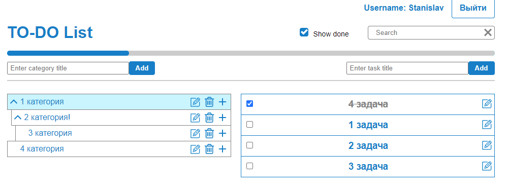

# Веб-приложение - многофункциональный TODO-лист

Многофункциональный TODO-лист с неограниченной вложенностью категорий и фильтрацией прикрепленных задач + страница авторизации + CRUD API на Node JS



### Данное приложение реализует:
* SPA с React Router 6
* работу с Redux-Thunk store
* Используется Typescript на клиенте
* Взаимосвязь клиента и сервера посредством Node js + express + MongoDB
* sass-стили

## Для входа в приложение необходимо ввести логин-пароль:
#### Login: Stanislav
#### Password: 12345

## Установка в режиме developer
```
npm run start:dev
```

## Установка в режиме production
```
npm run start:prod
```


## Операции перед production
#### BASE_URL client
Файл:
```
client/src/ReduxStore/actions/constants/api.ts
```
Заменить (1 строка)
```
http://localhost:5000/api => https://powerful-garden-53966.herokuapp.com/api или на другой адрес сервера
```
#### BASE_URL server
Файл:
```
server/config/default.json
```
Заменить: (13 строка)
```
http://localhost:5000 => https://powerful-garden-53966.herokuapp.com или на другой адрес сервера
```
#### CLIENT_URL server
Файл:
```
server/config/default.json
```
Заменить: (14 строка)
```
http://localhost:3000 => https://krikun1983-react-redux-ts-node-express.netlify.app или на другой адрес клиента
```